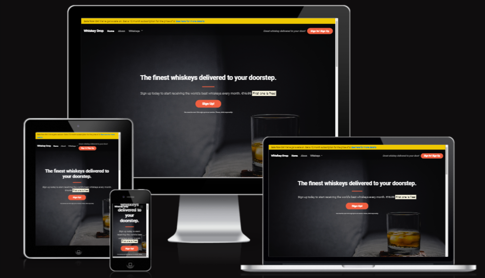

# Whiskey Drop Landing Page

## Overview

Whiskey Drop is a subscription service that delivers a curated selection of the finest whiskeys from around the world to your doorstep every month. The Whiskey Drop landing page is a web page that showcases the benefits and features of Whiskey Drop, and encourages visitors to sign up for the service. The landing page includes the following sections:

- A callout section that displays the main headline, a subheading, a sign up button, and a disclaimer.
- A quotes section that displays some testimonials from satisfied customers.
- A features section that displays some of the advantages of Whiskey Drop, such as discovering new flavors, saving money and time, and joining a community of whiskey lovers.
- A monthly favorites section that displays a table of the top 5 whiskeys of the month, with their name and origin.
- A navbar that displays the Whiskey Drop logo and some links to the home, about, and login pages.

## Technologies

The Whiskey Drop landing page was created using the following technologies:

- HTML5: A markup language that defines the structure and content of web pages.
- CSS3: A style sheet language that describes the appearance and layout of web pages.
- Bootstrap 4.6.2: A framework that provides a set of predefined classes and utilities for creating responsive and mobile-friendly web pages.
- Git: A version control system that tracks and manages changes to the source code.
- GitHub: A platform that hosts and facilitates collaboration on Git repositories.

## Installation

To install and run the Whiskey Drop landing page on your local machine, follow these steps:

1. Clone or download the GitHub repository for the Whiskey Drop landing page project from this link: https://yosephdev.github.io/whiskey-drop/
2. Open the index.html file in your preferred browser, or use a live server extension if you are using a code editor like Visual Studio Code.
3. Enjoy the Whiskey Drop landing page and explore its features.

## Testing

The Whiskey Drop landing page was tested for functionality, usability, compatibility, and responsiveness using the following tools, methods, and frameworks:

- Chrome DevTools: A set of web developer tools that allows you to inspect, edit, and debug the HTML, CSS, and JavaScript code of your web page, as well as simulate different devices, screen sizes, and network conditions.
- W3C Markup Validation Service: A tool that checks the validity and syntax of your HTML code and reports any errors or warnings.
- W3C CSS Validation Service: A tool that checks the validity and syntax of your CSS code and reports any errors or warnings.
- Lighthouse: A tool that audits the performance, accessibility, best practices, and SEO of your web page and provides a score and a report for each category.

## Credits

The content, media, and assistance for the Whiskey Drop landing page were obtained from the following sources:

- Content: The text content for the landing page was partly inspired by the Code Institute's video tutorial on how to create a whiskey drop landing page.
- Media: The images for the landing page were downloaded from Unsplash, a website that provides free high-quality photos.
- Assistance: The guidance and support for the landing page project were provided by the Code Institute, an online platform that offers courses on web development and software engineering.

## Acknowledgments

I would like to thank the following organizations for their help and inspiration for the Whiskey Drop landing page project:

- The Code Institute, for providing the video tutorial, the starter code, and the learning materials for the landing page project.
- Unsplash, for providing the images for the landing page project.